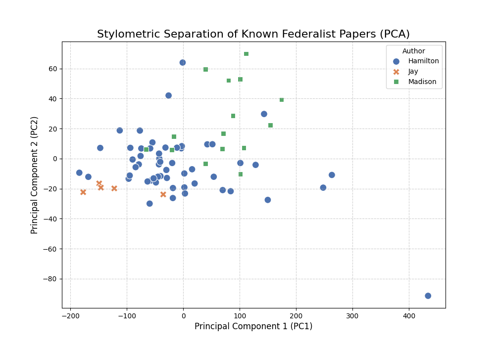
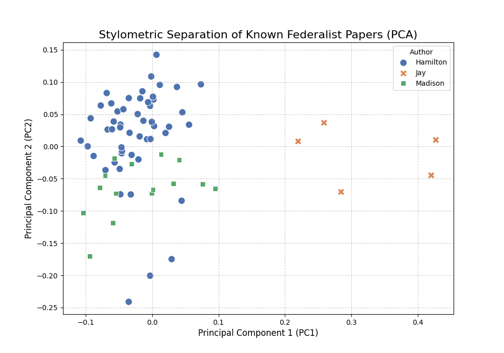

# Federalist Papers — Stylometric Authorship Analysis
 
> *Can machine learning determine who wrote a 230-year-old document?*  
> This project applies NLP and unsupervised learning to one of history's most debated authorship questions.
 
---
 
## The Problem
 
The Federalist Papers (1787–88) are 85 political essays that shaped the U.S. Constitution. While most are attributed to Alexander Hamilton, James Madison, or John Jay, **12 papers remain disputed** — claimed by both Hamilton and Madison. Traditional historical analysis has debated this for centuries.
 
This project approaches it as a **data science problem**: if two authors have distinct writing styles, those differences should be measurable and separable — regardless of topic or intent.
 
---
 
## Approach
 
Rather than relying on content or political argument (which would be misleading — both authors agreed on the essays' goals), the analysis focuses on **stylometric features**: patterns in *how* someone writes, not *what* they write.
 
### Feature Engineering
- **TF-IDF vectorisation** of function words (articles, prepositions, conjunctions) — words chosen unconsciously, making them strong stylistic fingerprints
- Sentence length distributions and punctuation frequency
- Vocabulary richness metrics per author
### Dimensionality Reduction & Visualisation
- **PCA** applied to reduce the high-dimensional TF-IDF space to 2D
- Visualised authorial clusters to assess separability before any classification
### Analysis
- Compared known Hamilton and Madison papers to establish stylometric baselines
- Projected disputed papers into the same feature space to assess authorial proximity
- Evaluated cluster cohesion and separation to validate the approach
---
 
## Key Findings
 
- Hamilton and Madison show **clear stylometric separation** in PCA space, confirming that function-word patterns alone can distinguish the two authors
- The TF-IDF-based PCA projection produces tighter, more distinct clusters than raw frequency features — validating the feature engineering choice
- The disputed papers cluster closer to **Madison's stylistic region**, consistent with the academic consensus formed through other methods
---
 
## Tech Stack
 
| Tool | Purpose |
|------|---------|
| Python | Core analysis |
| Scikit-learn | TF-IDF vectorisation, PCA |
| Pandas / NumPy | Data manipulation |
| Matplotlib / Seaborn | Visualisation |
| Jupyter Notebook | Reproducible analysis |
 
---
 
## Visual Output
 
**PCA Separation — Raw Features**  

 
**PCA Separation — TF-IDF Features**  

 
The second plot shows significantly cleaner cluster separation, demonstrating the impact of TF-IDF weighting on stylometric signal quality.
 
---
 
## Project Structure
 
```
stylometry_data_analysis_project/
│
├── Federalist_Papers_Stylometric_Analysis.ipynb   # Full analysis notebook
├── pca_stylometric_separation.png                 # Visualisation (raw features)
├── pca_stylometric_separation_usingtfidf.png      # Visualisation (TF-IDF features)
└── README.md
```
 
---
 
## Why This Matters Beyond the Federalist Papers
 
Stylometric analysis has real-world applications in **forensic linguistics**, **plagiarism detection**, **fake review identification**, and **AI-generated content attribution**. The same TF-IDF + PCA pipeline used here generalises to any authorship verification problem — making this a practical template, not just a historical exercise.
 
---
 
## How to Run
 
```bash
git clone https://github.com/AK888-hp/stylometry_data_analysis_project.git
cd stylometry_data_analysis_project
pip install -r requirements.txt   # numpy, pandas, scikit-learn, matplotlib, seaborn
jupyter notebook Federalist_Papers_Stylometric_Analysis.ipynb
```
 
---
 
*Project by K. Anantha Krishna Rao — B.Tech AI & ML, National Institute of Engineering, Mysore*
